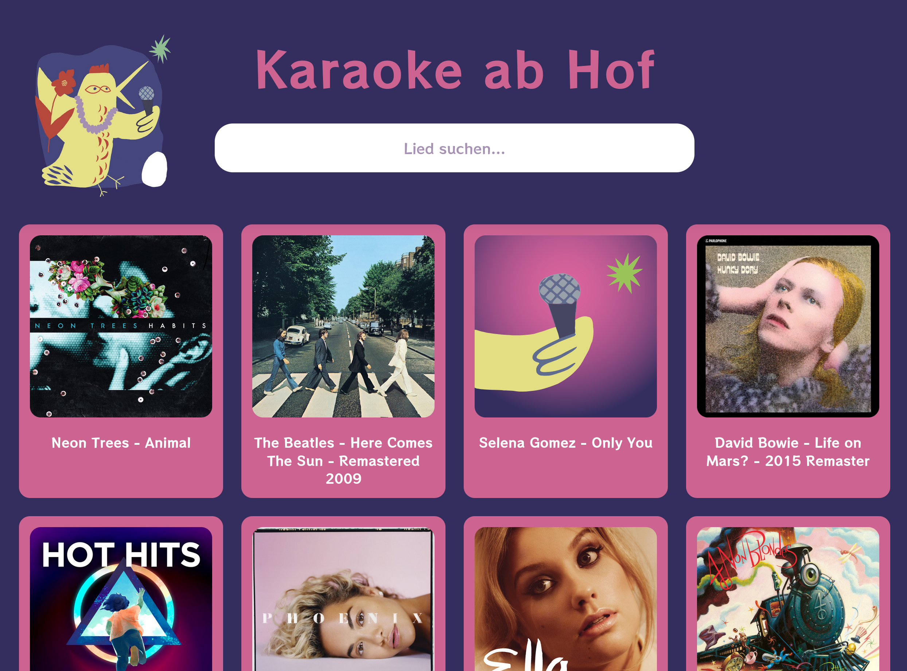

# Karaoke ab Hof 🎤

[](http://www.wtfpl.net/about/)

A local web-based karaoke video player application originally built for the festival ["Kultur ab Hof"](https://kulturabhof.at/).



## What it is

- A web application to browse and play a local collection of karaoke videos
- Fast search-as-you-type filtering by artist name or song title
- Full-window video player experience (ideal for kiosk mode)
- Built-in statistics: play counts, completion rates, and interactive charts
- Responsive design optimized for large screens but works on smaller devices too

**Why offline?** This app was designed for the "Kultur ab Hof" festival where internet connectivity is limited or unavailable. Instead of relying on YouTube or streaming services, it uses a local collection of karaoke videos that work completely offline.

## How to Use

1. Collect karaoke video files (you can use [yt-dlp](https://github.com/yt-dlp/yt-dlp) to download from YouTube)
2. Generate JSON metadata and download cover art using the script `update-song-data.py`
3. Start a local web server and open the app in your browser

```bash
# 1. Clone the repository
git clone https://github.com/lumbric/karaoke-videoplayer/
cd karaoke-videoplayer

# 2. Create videos folder and add your MP4 files
mkdir videos

# Put your MP4 karaoke videos in the "videos" folder, file names will be used for metadata search queries

# To download videos you can do so using yt-dlp
# pip install yt-dlp
# for url in $(cat song-urls.txt); do yt-dlp --format mp4 "$url"; done

# 3. Generate metadata and covers (requires ffprobe and spotdl; see notes below)
script/update-song-data.py  
# For offline mode (only filename + duration):
# script/update-song-data.py --no-internet

# 4. Start a web server of your choice
# This step can be omitted if you enable direct file access in your browser (see below).
python3 -m http.server 8000

# 5. Open your browser and navigate to:
# http://localhost:8000
```

### Quick start with kiosk mode

Use the included script to automatically start a web server and open the browser in kiosk mode:

```bash
chmod +x scripts/start.sh
scripts/start.sh
```

**Note:** Users can still exit kiosk mode using keyboard shortcuts (Alt+F4, Alt+Tab).


### Use a web server or allow local file access

Modern browsers block direct file access for security reasons (CORS policy). When you open an HTML file directly using the `file://` protocol, the browser may block loading local videos and JSON files.

**Two ways to run the app:**

1. **Local web server (recommended):**
   ```bash
   python3 -m http.server 8000
   # Then visit: http://localhost:8000
   ```

2. **Direct file access (requires browser configuration):**
   - **Chromium/Chrome:** Launch with `--allow-file-access-from-files` flag
   - **Firefox:** Set `about:config` → `security.fileuri.strict_origin_policy` = `false`

The web server approach is recommended as it's safer and avoids CORS complications.


## How it works

The app is a single HTML file (`index.html`) that loads a JSON file (`videos.json`) containing your song library. Each entry provides metadata for search (artist/title), duration (for statistics), and cover art information.

Statistics are stored locally in your browser's localStorage and reflect activity on the current device/browser only. Use the "Export Data" button on the stats page to download a JSON backup of your viewing history.

## The update script

**update-song-data.py** is a Python helper script that:

- Scans the `videos/` folder for video files and writes `videos.json` and `extra_metadata.json`
- Retrieves rich metadata (artist, title, genres) and downloads cover art via `spotdl` when internet is available
- Extracts video duration using `ffprobe` (part of ffmpeg)
- Can resume operation if interrupted (progress is saved regularly to disk)

### Requirements for full functionality:
- **Python 3.8+** with the `requests` package (`pip install requests`)
- **ffmpeg/ffprobe** installed and available on PATH
- **spotdl CLI** installed (`pip install spotdl` or `pipx install spotdl`)

### Usage:
```bash
# Full mode (with internet): fetch metadata and covers
script/update-song-data.py

# Offline mode: only add filenames and durations
script/update-song-data.py --no-internet

# Verbose output for debugging
script/update-song-data.py -v
```


## How it works

The app is a single HTML file (`index.html`) that loads a JSON file (`videos.json`) listing available songs. Each entry provides metadata for search (artist/title), duration (used for stats), and cover art.

Statistics are stored locally in your browser (localStorage) and reflect activity on the current device/browser only. Use the “Export Data” button on the stats page to download a JSON snapshot.

## Scripts

**update-song-data.py:**

- Scans `videos/` for video files, writes `videos.json` and `extra_metadata.json`.
- Retrieves metadata (artist, title, genres) and cover art via `spotdl` when internet is available.
- Extracts video duration via `ffprobe` (part of ffmpeg).

You can always abort the script and resume operation as JSON files are reguarly dumped to the disk and re-loaded when the script is started again.

If you do not have internet access, you can use the script to simply add the file names to the videos.json file without querying for cover art and artist/song title.

Requirements to use all features:
- Python 3.8+ with `requests` (`pip install requests`), note that 
- ffmpeg/ffprobe installed and on PATH
- spotdl CLI installed (`pipx install spotdl` or `pip install spotdl`)

## File Structure

```
karaoke-videoplayer/
├── videos/                     # Your MP4 karaoke videos
├── covers/                     # Cover images (auto-downloaded by the script)
├── scripts
│   ├── rename-video-files.sh   # clean file names after downloading them from Youtube
│   ├── start.sh                # Starts a local server + browser in kiosk mode
│   └── update-song-data.py     # Generates/updates videos.json, fetches covers/metadata
├── static/                     # App assets (font, fallback cover, chart.js)
├── index.html                  # The application
├── extra_metadata.json         # Extra info from spotdl (not used by the web app)
└── videos.json                 # Video metadata (auto-generated)
```

### Files

**videos.json (required):**

List of your songs. Only `filename` and `duration_seconds` are required by the app. If no `artist`/`title` are provided, the filename (without extension) will be displayed.

By default, the app assumes these paths:
  - Video file: `videos/{filename}.mp4`
  - Cover image: `covers/{filename}.jpg`

To override default paths (e.g., different file extensions), use these optional fields:
  - `file`: full/relative path to the video file
  - `cover`: full/relative path to the cover image

Example:

```json
[
  {
    "filename": "Die Ärzte - Schrei nach Liebe",
    "duration_seconds": 273.25,
    "artist": "Die Ärzte",
    "title": "Schrei nach Liebe",
    "genre": [
      "neue deutsche welle",
      "german pop"
    ],
    "has_cover": true,
    "processed_at": "2025-08-08T10:36:55Z"
  },
  {
    "filename": "Green Day - Basket Case (karaoke)",
    "duration_seconds": 186.5,
    "artist": "Ameritz - Karaoke",
    "title": "Basket Case (In the Style of Green Day) [Karaoke Version]",
    "has_cover": true,
    "processed_at": "2025-08-08T10:36:55Z"
  }
]
```

**extra_metadata.json (optional):**
Generated by `update-song-data.py` containing extended metadata from spotdl (cover URLs, lyrics, etc.). Used only by the update script for re-generating `videos.json`. Not directly used by the web app.

**Video files:**
Karaoke video files stored in `videos/`. Ideally named `Artist - Title.mp4` since the filename is used for metadata searches.

**Cover art:**
JPEG images in `covers/`. Downloaded automatically by `update-song-data.py` when internet is available. The app shows a default cover icon when no cover image exists.


### Controls
- **Search**: Type in the search box to filter songs
- **Play Video**: Click any song card to start playing
- **Fullscreen**: Videos fill the window (good for kiosk mode)
- **Player Controls**: 
  - ✕ button to close/exit fullscreen
  - ⏸ Pause/▶ Play button
  - ↻ Restart button to replay from beginning
- **Statistics**: Click the chart button to view song popularity and usage stats

### Keyboard shortcuts:
- **ESC**: Exit fullscreen video, close stats page, or clear search (when idle)
- **Space**: Pause/play video (when video is active)


## Desktop Setup 2025

At ["Kultur ab Hof"](https://kulturabhof.at/) we used a simple 4GB desktop computer

The setup:
- A sudo user "kah", password can be found on a paper inside the machine
- A non-privileged user "singer" which is set to auto login and has no password. 
    - After login of user *singer*, Firefox starts the karaoke player in kiosk mode.
    - Several keyboard shortcuts like ALT + F4, ALT + TAB are disabled in the Ubuntu settings.
    - It is not impossible to escape, but users cannot break a lot (only delete the statistics and user settings).
- Use CTRL+ALT+F3 (or F4), login with user *kah* and run `sudo -u singer killall firefox`, then switch back to user *singer* to change settings or clear the statistics.

*/home* is a separate partion. The machine runs on Ubuntu with 24.04.3 LTS.

Many manual modifications were made:
- disable screensaver 
- disable sysem sounds
- Firefox
    - allow direct file access
    - disable devtools
- allow empty passwords by addng `nullok` in /etc/pam.d/common-password to the line: `password	[success=2 default=ignore]	pam_unix.so obscure use_authtok try_first_pass yescrypt nullok`
- Disable the Windows key: gsettings set org.gnome.mutter overlay-key 
- ...
