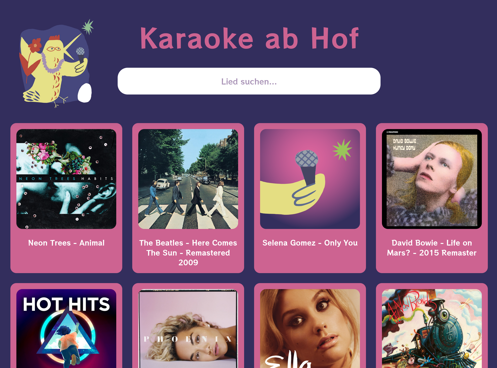
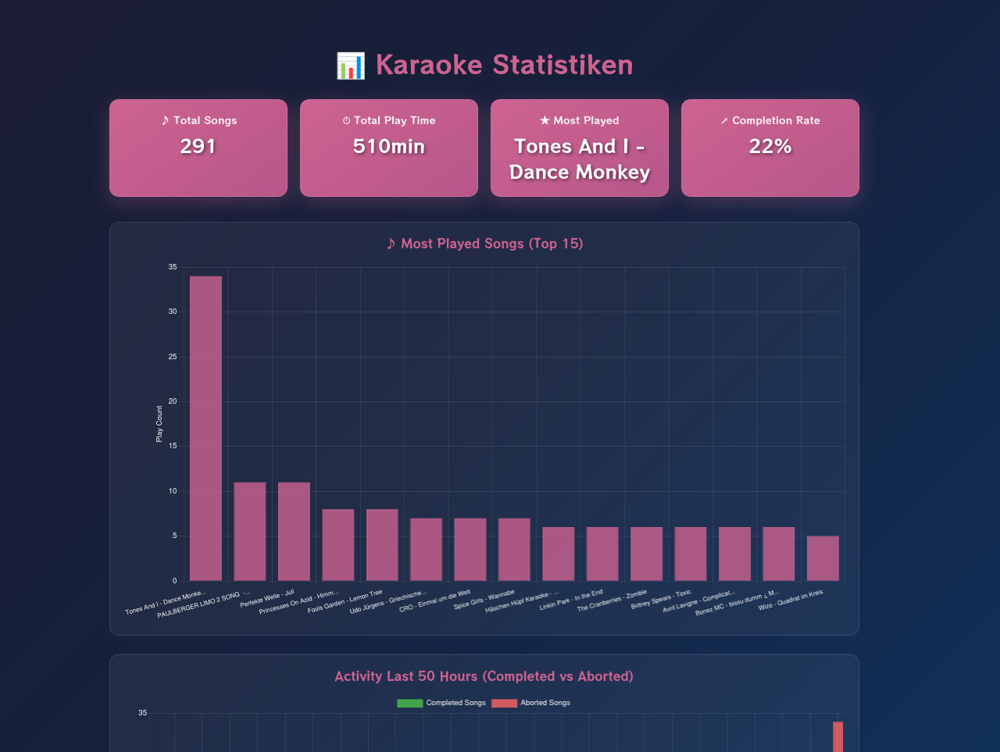
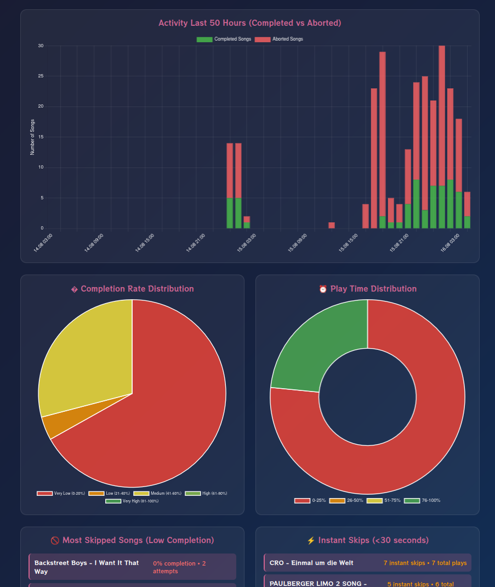

# Karaoke ab Hof 🎤

[](http://www.wtfpl.net/about/)

A local web-based karaoke video player application originally built for the festival ["Kultur ab Hof"](https://kulturabhof.at/).








> **⚠️ AI-Generated Code — Not Human-Reviewed**
>
> This project was generated using different LLMs (large language models). The code has **not** been reviewed by a human. It is a toy project. It seems to work well enough for its purpose and the risk is low, but treat it accordingly: no guarantees, no warranty, use at your own risk.


## Features

- **Local song catalog** — browse and search a local collection of karaoke videos, fast search-as-you-type by artist, title, or genre
- **Genre filtering** — filter songs by genre via dropdown
- **Featured songs** — some songs are highlighted in the grid based on configurable probability and window
- **Online search** — search YouTube or Invidious for karaoke videos not in the local catalog (requires internet + API key or Invidious instance)
- **AI song suggestions** — chat with an AI (OpenAI) to get personalized song suggestions, the AI can optionally see the full local catalog
- **Song requests** — users can submit song requests (stored in localStorage)
- **Problem reports** — users can report issues with specific songs (video errors, audio problems, wrong metadata, etc.)
- **Fullscreen video player** — full-window playback for local videos and YouTube embeds, with progress bar, pause/play, restart, and close controls
- **Statistics dashboard** — play counts, completion rates, hourly activity, play time distribution, instant skips, skipped songs, hidden gems, retry patterns, search sessions, AI chat log, and data export
- **Themed UI** — multiple built-in themes (`default`, `karaoke-ab-hof2025`, `karaoke-ab-hof2026`), each with its own CSS, logo, cover fallback, and AI branding
- **Lazy-loaded covers** — cover images load on demand with fade-in and fallback
- **Infinite scroll** — songs load in batches as you scroll
- **No-results panel** — helpful actions when a search finds nothing (online search, AI suggestions, song request)
- **Kiosk-friendly** — designed for kiosk mode with keyboard shortcuts and minimal UI chrome
- **Offline-first** — works completely without internet when online features are disabled
- **Responsive** — optimized for large screens, works on smaller devices too


**Version 2:** Version 2 is a **complete rewrite** of version 1. The original v1 was a single `index.html` file with inline JavaScript. V2 is a modern Vue 3 + TypeScript SPA built with Vite, using Pinia for state management and Chart.js for statistics.

Key differences from v1:
- Proper component architecture (Vue 3 SFCs)
- TypeScript throughout
- Pinia stores for state (catalog, playback, config, online search, AI suggestions)
- JSON-based configuration (no more editing JS source files)
- Themed UI with per-theme assets and config
- Online search and AI suggestions (optional, internet required)
- Song requests and problem reports
- Enhanced statistics with more charts and metrics
- Unit, component, and E2E tests


## Configuration

The app is configured via JSON files in `public/`. No need to edit source code.

### `config.json` — Main configuration

See `public/config.example.json` for a commented example. Key sections:

```jsonc
{
  "theme": {
    "name": "karaoke-ab-hof2026",   // theme folder name under public/themes/
    "title": "Karaoke ab Hof"        // displayed in header and browser tab
  },
  "features": {
    "onlineFeatures": true,          // master switch for all online features
    "onlineSearch": true,            // enable online search button
    "aiSuggestions": true,           // enable AI suggestion chat (needs OpenAI key)
    "filterEmbeddableVideos": true   // only show YouTube videos that allow embedding
  },
  "search": {
    "batchSize": 30,                 // songs loaded per scroll batch
    "maxDisplayCount": 500,          // max songs shown before "load more" button
    "initialOrder": "random",        // "random" or "alphabetical"
    "randomSeed": 42,                // seed for reproducible shuffle
    "showMetadataSnippet": false,    // show genre snippet on song cards
    "featuredProbability": 0.3,      // probability a song is featured
    "featuredWindow": 8              // window size for featured selection
  },
  "providers": {
    "searchProviders": [             // where online search queries go
      { "type": "youtube" }          // or { "type": "invidious", "baseUrls": ["..."] }
    ],
    "videoProviders": [              // where online videos play from
      { "type": "youtube" }          // or { "type": "invidious", "baseUrls": ["..."] }
    ]
  },
  "ai": {
    "model": "gpt-4o",              // OpenAI model
    "maxSuggestions": 5,             // max suggestions per AI response
    "timeoutMs": 20000,              // request timeout
    "sendCatalog": false             // send full song catalog to AI (better matches, more tokens)
  }
}
```

### `secret-config.json` — API keys (git-ignored)

See `public/secret-config.example.json`. Contains sensitive keys:

```json
{
  "openAiApiKey": "sk-...",
  "youtubeApiKey": "..."
}
```

This file is **not** committed to git. Copy the example and fill in your keys.


### Themes

Each theme lives in `public/themes/<name>/` and contains:
- `theme.css` — all styling
- `theme.config.json` — cover fallback path, AI logo/title
- `logo.png` or `logo.svg` — header logo
- `cover_fallback.svg` or `cover_fallback.png` — shown when no cover art exists
- `ai-logo.png` (optional) — custom logo for the AI suggestion modal


## How to Use

1. Collect karaoke video files (you can use [yt-dlp](https://github.com/yt-dlp/yt-dlp) to download from YouTube)
2. Generate JSON metadata and download cover art using the script `scripts/update-song-data.py`
3. Build the app and serve it

```bash
# 1. Clone the repository
git clone https://github.com/lumbric/karaoke-videoplayer/
cd karaoke-videoplayer

# 2. Install dependencies
npm install

# 3. Create data folders and add your MP4 files
mkdir -p data/videos data/covers
# Put your MP4 karaoke videos in data/videos/

# 4. Generate metadata and covers (requires ffprobe and spotdl)
scripts/update-song-data.py
# For offline mode (only filename + duration):
# scripts/update-song-data.py --no-internet

# 5. Configure the app
cp public/config.example.json public/config.json
# Edit public/config.json to your liking

# 6. Build for production (or run 'npm run dev')
npm run build

# 7. Serve the dist/ folder (see "Serving" section below)
```


## Build Commands

| Command | Description |
|---|---|
| `npm run dev` | Start Vite dev server with hot reload (syncs data links first) |
| `npm run build` | Production build to `dist/` (type-checks with `vue-tsc` first) |
| `npm run preview` | Preview the production build locally |
| `npm run link:data` | Create symlinks from `data/` into `public/data/` and `dist/data/` |
| `npm run build:prod` | *(if available)* combined build + link for production |
| `npm test` | Run unit and component tests (Vitest) |
| `npm run test:watch` | Run tests in watch mode |
| `npm run test:e2e` | Run E2E tests (Playwright) |

Both `dev` and `build` run data link syncing automatically.


## Serving

### nginx (recommended)

We use **nginx** to serve the built app because it is significantly faster than `python3 -m http.server`, especially when serving many large video files. An example nginx config is in `desktop-setup/karaoke-ab-hof.conf`:

```nginx
server {
    listen 127.0.0.1:8000;
    root /home/karaoke-videoplayer/dist;
    index index.html;

    location / {
        try_files $uri $uri/ /index.html;
    }

    location /assets/ {
        expires 1y;
        add_header Cache-Control "public, immutable";
    }

    location ~* \.(svg|png|jpg|gif|ico|woff2?|ttf)$ {
        expires 30d;
    }
}
```

### python http.server (fallback)

For quick local testing you can still use Python's built-in server, but it is noticeably slower for production use:

```bash
python3 -m http.server 8000 --directory dist
```

### Direct file access (not recommended)

Modern browsers block direct file access for security reasons (CORS). If you must, launch Chromium with `--allow-file-access-from-files` or set the Firefox `about:config` flag `security.fileuri.strict_origin_policy` to `false`.


## Kiosk Mode

We use **[OpenKiosk](https://github.com/nickstenning/openkiosk)** to run the browser in kiosk mode. OpenKiosk locks down the browser more effectively than Firefox/Chromium's built-in `--kiosk` flag — it prevents access to URL bars, dev tools, and most keyboard shortcuts. Not all shortcuts can be blocked (e.g. Alt+F4 is handled by the window manager), but it covers the important ones.

The `scripts/start.sh` script tries OpenKiosk first, then falls back to `firefox --kiosk` or `chromium --kiosk`:

```bash
scripts/start.sh
```


## Desktop Setup 2025

At ["Kultur ab Hof"](https://kulturabhof.at/) we used a simple 4GB desktop computer.

The setup:
- A sudo user "kah", password can be found on a paper inside the machine
- A non-privileged user "singer" which is set to auto login and has no password.
    - After login of user *singer*, OpenKiosk starts the karaoke player.
    - It might not impossible to escape, but users cannot break a lot (only delete the statistics and user settings).

*/home* is a separate partition. The machine runs on Ubuntu with 24.04.3 LTS.

Many manual modifications were made:
- disable screensaver
- disable system sounds
- Firefox / OpenKiosk
    - allow direct file access (if needed)
    - disable devtools
- allow empty passwords by adding `nullok` in /etc/pam.d/common-password to the line: `password	[success=2 default=ignore]	pam_unix.so obscure use_authtok try_first_pass yescrypt nullok`
- Disable the Windows key: `gsettings set org.gnome.mutter overlay-key ""`
- ...


## The update script

**scripts/update-song-data.py** is a Python helper script that:

- Scans the `data/videos/` folder for video files and writes `data/songs.json` and `data/extra_metadata.json`
- Retrieves rich metadata (artist, title, genres) and downloads cover art via `spotdl` when internet is available
- Extracts video duration using `ffprobe` (part of ffmpeg)
- Can resume operation if interrupted (progress is saved regularly to disk)

### Requirements:
- **Python 3.8+** with the `requests` package (`pip install requests`)
- **ffmpeg/ffprobe** installed and available on PATH
- **spotdl CLI** installed (`pip install spotdl` or `pipx install spotdl`)

### Usage:
```bash
# Full mode (with internet): fetch metadata and covers
scripts/update-song-data.py

# Offline mode: only add filenames and durations
scripts/update-song-data.py --no-internet

# Verbose output for debugging
scripts/update-song-data.py -v
```


## Production with external data (recommended for large media libraries)

If your media library is large (e.g. 25GB+), keep it outside tracked source files and use symlinks.

Suggested local layout:

```text
karaoke-videoplayer/
  data/
    videos/
    covers/
    songs.json
    extra_metadata.json
```

`data/` is git-ignored, so you can update files there without touching git history.

Create links for development paths:

```bash
npm run link:data
```

`dev` and `build` run link syncing automatically. If needed, you can re-run manually.

Then serve `dist/` directly with nginx (see serving section above).

This avoids copying videos/covers into `dist/` and still lets you do last-minute updates by replacing files inside `data/`.


## Online Search Configuration

The app supports online search via YouTube Data API or Invidious instances. Configure providers in `config.json`:

```json
{
  "providers": {
    "searchProviders": [
      { "type": "youtube" }
    ],
    "videoProviders": [
      { "type": "youtube" }
    ]
  }
}
```

### Filter Embeddable Videos

When using YouTube as both search and video provider, some videos may fail to play because the content creator has restricted embedding. Set `"filterEmbeddableVideos": true` to only show videos that can be embedded.

**When to enable:** You use YouTube for both searching AND playback and want to avoid broken results.

**When to disable:** You use Invidious as video provider (Invidious can play most restricted videos) or you prefer more results.

**Default:** `false`


## File Structure

```
karaoke-videoplayer/
├── data/                          # Your media files (git-ignored)
│   ├── videos/                    # MP4 karaoke videos
│   ├── covers/                    # Cover images (auto-downloaded)
│   ├── songs.json                 # Song metadata (auto-generated)
│   └── extra_metadata.json        # Extended metadata from spotdl
├── desktop-setup/                 # Kiosk deployment configs
│   ├── karaoke-ab-hof.conf        # nginx config
│   └── kill-firefox.sh            # Password-protected browser kill script
├── public/
│   ├── config.json                # Main app config
│   ├── config.example.json        # Example config
│   ├── secret-config.json         # API keys (git-ignored)
│   ├── secret-config.example.json # Example secret config
│   └── themes/                    # UI themes
│       ├── default/
│       ├── karaoke-ab-hof2025/
│       └── karaoke-ab-hof2026/
├── scripts/
│   ├── rename-video-files.sh      # Clean file names after downloading
│   ├── start.sh                   # Start browser in kiosk mode
│   ├── sync-data-links.sh         # Create data symlinks
│   └── update-song-data.py        # Generate metadata and covers
├── src/
│   ├── components/                # Vue components
│   ├── services/                  # Business logic (config, search, stats, storage, ...)
│   ├── stores/                    # Pinia stores
│   ├── utils/                     # Helpers (fuzzy search, normalization, ...)
│   ├── App.vue                    # Root component
│   ├── main.ts                    # Entry point
│   └── types.ts                   # TypeScript type definitions
├── tests/e2e/                     # Playwright E2E tests
├── Dockerfile                     # Docker dev setup
├── docker-compose.yml             # Docker Compose services
├── vite.config.ts                 # Vite + Vitest config
├── tsconfig.json                  # TypeScript config
└── package.json                   # Dependencies and scripts
```
